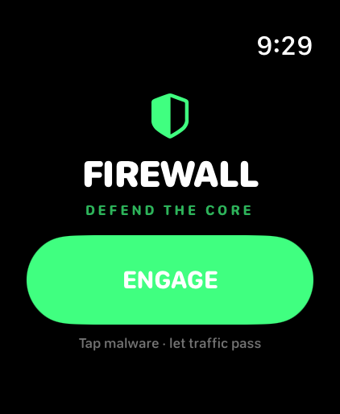
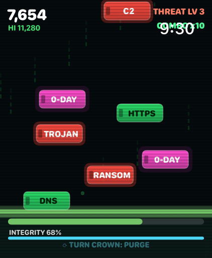
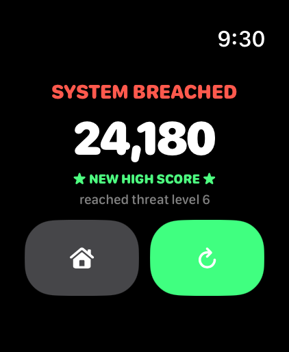

# Firewall 🛡️

A **cybersecurity arcade** for **Apple Watch** (built for the Watch Ultra, runs
on watchOS 10+). You're the firewall. Network traffic streams down toward your
server core — **tap the red malware** to block it (`TROJAN`, `RANSOM`, `WORM`,
`0-DAY`…) while **letting green traffic pass** (`HTTP`, `DNS`, `SSH`, `TLS`…).
Hold your **integrity** as the intrusion escalates, survive **DDoS floods**, and
when your scan charge fills, **turn the Digital Crown** to unleash a quarantine
purge.

Written entirely in **SwiftUI** — the whole thing is drawn in a `Canvas` driven
by a `TimelineView` loop, with a matrix backdrop, CRT scanlines, and Taptic
Engine alerts. No companion iPhone app required.

## Screenshots

_Captured on the Apple Watch Ultra 3 (49mm) simulator._

| Title | Defending the core | System breached |
|:-----:|:------------------:|:---------------:|
|  |  |  |

---

## Controls

| Input | Action |
|-------|--------|
| **Tap a packet** | Block it. Tapping **malware** = good; tapping **legit traffic** = a false positive (penalty) |
| **Digital Crown** | When the scan charge is full, turn it to **purge** every threat on screen |

## How it plays

- **Block the red, pass the green.** Red packets are malware — tap them before
  they reach the core. Green packets are legit traffic — let them through.
- **A threat that lands = a breach** (big integrity hit + screen shake). **Blocking
  good traffic** is a false positive (smaller penalty + combo reset). Served legit
  traffic even nudges your integrity back up.
- **Integrity** is your health bar — hit **0% and the system is breached** (game over).
- **0-DAY** packets are fast, magenta, and worth bonus points. **DDoS** waves
  telegraph with a red alert, then flood you with threats.
- **Combo multiplier** rewards clean, mistake-free play. Difficulty (spawn rate,
  packet speed, threat ratio) ramps with the **threat level**.
- High score is saved between sessions.

---

## Build & run

Requires **Xcode 16+** (developed on Xcode 26.5 / watchOS 26.5 SDK) on a Mac.

```bash
git clone https://github.com/at0m-b0mb/Firewall.git
cd Firewall
open Firewall.xcodeproj
```

1. Select the **Firewall Watch App** scheme.
2. **Simulator:** pick any Apple Watch simulator and press **Run** (⌘R). No watch
   simulators listed? Install a runtime via *Xcode ▸ Settings ▸ Components*.
   - To purge in the Simulator, click the Digital Crown on the watch's right edge
     and scroll once the charge bar is full.
3. **Your Apple Watch Ultra:** set your Team under *Signing & Capabilities*
   (needs a paid Apple Developer account to sideload to hardware), pick your
   watch, and Run.

> **If a run ever fails with "Invalid argument" / a missing executable**, do
> *Product ▸ Clean Build Folder* (⇧⌘K) and run again — that's a stale
> incremental-build artifact, not a code problem.

### Command-line build check

```bash
DEVELOPER_DIR=/Applications/Xcode.app/Contents/Developer \
xcodebuild -project Firewall.xcodeproj -scheme "Firewall Watch App" \
  -sdk watchsimulator26.5 -destination 'generic/platform=watchOS Simulator' \
  -derivedDataPath /tmp/FirewallDD CODE_SIGNING_ALLOWED=NO build
```

---

## Project layout

```
Firewall/
├─ Firewall.xcodeproj
├─ Screenshots/                # images used in this README
└─ FirewallWatchApp/
   ├─ FirewallApp.swift        # @main entry, owns the GameEngine
   ├─ ContentView.swift        # phase router (menu / play / game over)
   ├─ MenuView.swift           # title screen + ENGAGE
   ├─ GamePlayView.swift       # Canvas host: loop + spatial tap + Crown-purge
   ├─ GameOverView.swift       # result screen, replay / home
   ├─ GameEngine.swift         # the whole simulation — spawns, scoring, integrity,
   │                           #   combos, DDoS, purge, difficulty ramp
   ├─ FirewallRenderer.swift   # stateless cyber drawing of every frame
   ├─ Models.swift             # packet/particle types + threat vocab
   ├─ Haptics.swift            # Taptic Engine wrapper (feedback by intent)
   └─ Assets.xcassets          # app icon + accent colour
```

## Tuning

Spawn rate, packet speed, threat ratio, integrity damage, DDoS cadence, and the
purge rules all live in **`GameEngine.swift`** (`updateSpawns`, `makePacket`,
`breach`, `falsePositive`, `tryPurge`). The look — packets, the firewall line,
matrix rain, HUD — is in **`FirewallRenderer.swift`**.

> The screenshots were generated with a **Debug-only** demo hook in
> `GameEngine.swift` (gated behind the `FW_DEMO` launch environment variable and
> compiled out of Release), e.g.
> `SIMCTL_CHILD_FW_DEMO=play xcrun simctl launch booted com.at0mb0mb.firewall`.
